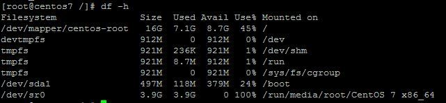

<!--
 * @Author: liu kang
 * @Date: 2023-04-21 12:23:59
 * @LastEditors: LiuKang
 * @LastEditTime: 2023-04-21 12:24:05
 * @FilePath: \Notes\common\linux\shell.md
 * @Description: 
 * 
 * Copyright (c) 2023 by ${git_name_email}, All Rights Reserved. 
-->

# Common


## [tar](https://blog.csdn.net/example440982/article/details/51712973)

tar -cvf test.tar test  #仅打包，不压缩
tar -zcvf test.tar.gz test  #打包后，以gzip压缩 在参数f后面的压缩文件名是自己取的，习惯上用tar来做，如果加z参数，则以tar.gz 或tgz来代表gzip压缩过的tar file文件
tar -zcvf dist.tar.gz -C dist .  #注意最后有一点，通过 -C 参数指定目录，可以去掉打包内容包含相对目录，打包内容只包含 dist/* 下的文件内容，不包含 dist 目录

---

## [查看磁盘空间](https://www.runoob.com/w3cnote/linux-view-disk-space.html)

1.df

df 以磁盘分区为单位查看文件系统，可以获取硬盘被占用了多少空间，目前还剩下多少空间等信息。

例如，我们使用**df -h**命令来查看磁盘信息， **-h** 选项为根据大小适当显示：

  

```

```

2.du

**du** 的英文原义为  **disk usage** ，含义为显示磁盘空间的使用情况，用于查看当前目录的总大小

```

du -sh 查看当前目录的大小
du log2012.log  显示指定文件所占空间
du -h test 方便阅读的格式显示test目录所占空间情况

-s：对每个Names参数只给出占用的数据块总数。
-a：递归地显示指定目录中各文件及子目录中各文件占用的数据块数。若既不指定-s，也不指定-a，则只显示Names中的每一个目录及其中的各子目录所占的磁盘块数。
-b：以字节为单位列出磁盘空间使用情况（系统默认以k字节为单位）。
-k：以1024字节为单位列出磁盘空间使用情况。
-c：最后再加上一个总计（系统默认设置）。
-l：计算所有的文件大小，对硬链接文件，则计算多次。
-x：跳过在不同文件系统上的目录不予统计。
-h：以K，M，G为单位，提高信息的可读性。

```

---
