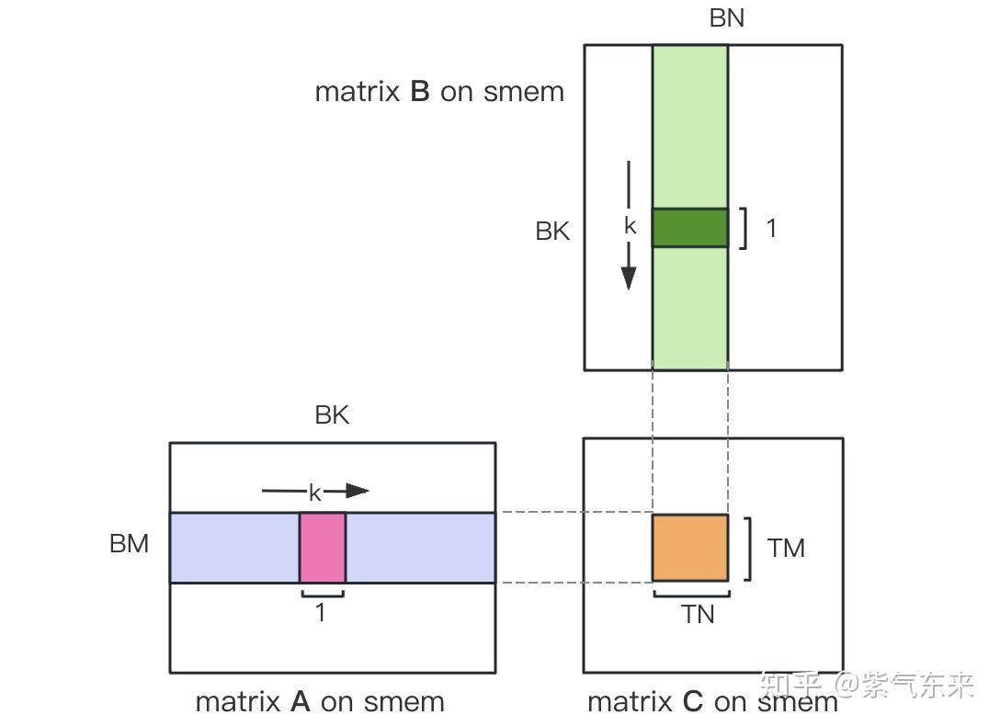
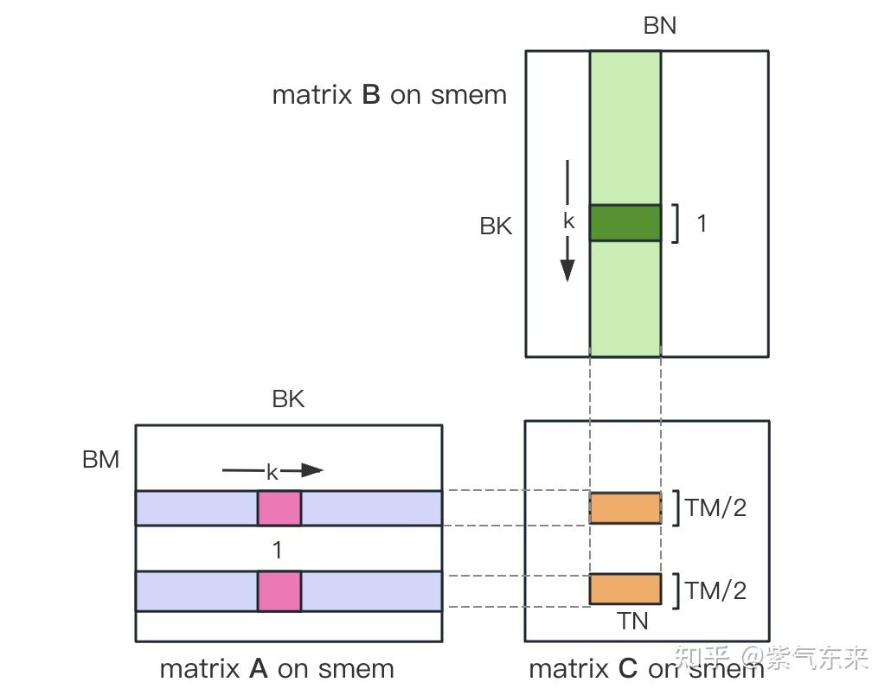
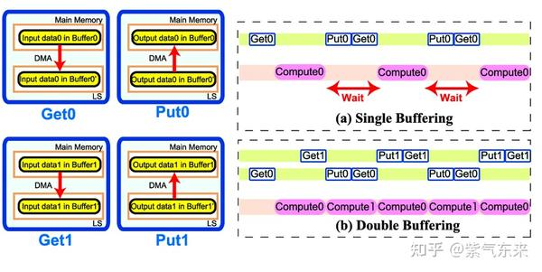

<!--
 * @Author: liu kang
 * @Date: 2024-10-24 23:18:34
 * @LastEditors: faaaade
 * @LastEditTime: 2024-10-31 00:12:28
 * @FilePath: \Notes\cuda\cuda-learn-note\gemm.md
 * @Description: 
 * 
 * Copyright (c) 2024 by ${git_name_email}, All Rights Reserved. 
-->

# [gemm](https://zhuanlan.zhihu.com/p/657632577)

## naive 实现

```cpp
//fp32

#define OFFSET(row, col, ld) ((row)*(ld) + (col))
__global__ void naiveSgemm(float* __retrict__ a, float * __restrict b, float* __retrict__ c, const int MM, const int N, const int K){

    int n = blockIdx.x * blockDim.x + threadIdx.x;
    int m = blockIdx.y + blockDim.y + threadIdx.y;

    if(m<M && x<N){
        float psum = 0.0;
        #pragma unroll
        for(int k=0; k<K; k++){
            psum += a[OFFSWT(m,k, K)]*b[OFFSET(k,n, N)];
        }
        c(OFFSET(m, n, N)) = psum;
    }

}

const int BM = 32, BN = 32;
const int M = 512, N = 512, K=512;
dims3 blockDim(BN, BM);
dime3 gridDim((N+BN-1)/BN,(M+BM-1)/BM)


```

## share mem



```cpp
__global__ void sgemm_V1(
    float * __restrict__ a, float* __restrict__ b, float* __restrict__ c, const int M, const int N,
    const int K
){
    const int BM = 128;
    const int BN = 128;
    const int BK = 8;
    const int TM = 8;
    const int TN = 8;

    const int bx = blockIdx.x;
    const int by = blockIdx.y;

    const int tx = threadIdx.x;
    const int ty = threadIdx.y;
    
    const int tid = ty * blockDimx.x + tx;

    __shared__ float s_a[BM][BK];
    __shared__ float s_b[BK][BN];

    float r_c[TM][TN] = {0.0};

    int load_a_smem_m = tid >> 1;
    int load_a_smem_k = (tid & 1) << 2;
    int load_b_smem_k = tid >> 5;
    int load_b_smem_n = (tid&3`)<<2;

    for(int bk =0; bk<(K+BK-1)/BK ; bk++){
        int load_a_gmem_k = bk*BK + load_a_smem_k;
        int load_a_gmem_addr = OFFSET(load_a_gmmem, load_a_gmem_k, K);
        FLOAT4(s_a[load_a_smem_m][load_a_smemm_k]) = FLOAT4(a[load_a_gmem_addr]);
        int load_b_gmemm_k = bk * BK + load_b_smem_k;
        int load_b_gmem_addr = OFFSET(load_b_gmem_k, load_b_gmem_n, N);
        FLOAT4(s_b[load_b_smem_k][load_b_smem_n]) = FlOAT4(b[load_b_gmem_addr]);
        __syncthreads();

        #pragma unroll
        for(int k = 0; k < Bk; k++ ){
            #pragram unroll
            for(int m=0; m<TM ; m++){
                #pragram unroll 
                for(int n =0; n <TN; n++){
                    int comp_a_smem_m = ty * TM + m;
                    int comp_b_smem_n = tx * TN + n;
                    r_c[m][n] += s_a[comp_a_smem][k]*s_b[k][comp_b_smem_n];
                }
            }
        }

        __syncthreads();

    }
    #pragma unroll
    for(int i=0; i<TM; i++){
        int store_c_gmem_m = by*BM + ty*TM + i;
        #pragma unroll
        for(int j=0; j< TN; j+=4){
            int store_c_gmem_n = bx * BN + tx * TN + j;
            int store_c_gmem_addr = OFFSET(store_c_gmem_m, store_c_gmem_n, N);
            FLOAT4(c[store_c_gmem_addr]) = FLOAT4(r_c[i][j]);
        }
    }


}
```

## share mem without bank conflict
  

```cpp
__global__ void sgemm_V1(
    float * __restrict__ a, float* __restrict__ b, float* __restrict__ c, const int M, const int N,
    const int K
){
    __shared__ float s_a[BK][BM];
    __shared__ float s_b[BK][BN];

    float r_load_a[4];
    float r_load_b[4];
    float r_comp_a[TM];
    float r_comp_b[TN];
    float r_c[TM][TN] = {0.0};

    int load_a_smem_m = tid >> 1;
    int load_a_smem_k = (tid&1)<<2;
    int load_b_smem_k = tid>>5;
    int load_b_smem_n = (tid&31) << 2;

    int load_a_gmem_m = by * BM + load_a_smem_m;
    int load_b_gmem_n = bx * BN + load_b_smem_n;

    for(int bk = 0; bk<(K+BK-1)/BK;bk++ ){

        int load_a_gmem_k = bk * BK + load_a_smem_k;
        int load_a_gmem_addr = OFFSET(load_a_gmem_m, load_a_gmem_k, K);
        int load_b_gmem_k = bk * BK + load_b_smem_k;
        int load_b_gmem_addr = OFFSET(load_b_gmem_k, load_b_gmem_n, N);
        FLOAT4(r_load_a[0]) = FLOAT4(a[load_a_gmem_addr]);
        FLOAT4(r_load_b[0]) = FLOAT4(b[load_b_gmem_addr]);

        s_a[load_a_smem_k][load_a_smem_m] = r_load_a[0];
        s_a[load_a_smem_k + 1][load_a_smem_m] = r_load_a[1];
        s_a[load_a_smem_k + 2][load_a_smem_m] = r_load_a[2];
        s_a[load_a_smem_k + 3][load_a_smem_m] = r_load_a[3];
        FLOAT4(s_b[load_b_smem_k][load_b_smem_n]) = FLOAT4(r_load_b[0]);

        __syncthreads();

        #pragram unroll
        for(int tk = 0 ; tk <BK ; tk++){
            FLOAT4(r_comp_a[0]) = FLOAT4(s_a[tk][ty*TM/2]);
            FLOAT4(r_comp_a[4]) = FLOAT4(s_a[tk][ty*TM/2 + BM/2]);
            FLOAT4(r_cpmp_b[0]) = FLOAT4(s_b[tk][tx*TN/2]);
            FLOATs(t_cpmp_b[4]) = FLOAT4(s_b[tk][tx*TN/2 + BN/2]);

            #pragma unroll
            for(int tm = 0; tm < TM; tm++){
                #pragma unroll
                for(int tn =0; tn <TN; tn++){
                    r_c[tm][tn] += r_comp_a[tm]*r_comp_b[tn];
                }
            }

        }
        __syncthreads();
    }
    #pragma unroll
    for(int i=0; i< TM/2; i++){
        int store_c_gmem_m = by * BM + BM / 2 + ty*TM/2 + i;
        int stote_c_gmem_n = bx * BN + tx*TN/2;
        int store_c_gmem_addr = OFFSET(store_c_gmem_m, store_c_gmem_n, N);
        FLOAT4(c[store_c_gmem_addr]) = FLOAT4(r_c[i+TM/2][0]);
        FLOAT4(c[store_c_gmem_addr+ BN/2]) = FLOAT4(r_c[i+TM/2][4]);
    }

}

```

## 流水并行

  

```cpp
__global__ void sgemm_V3(
    float * __restrict__ a, float * __restrict__ b, float * __restrict__ c,
    const int M, const int N, const int K) {
        const int BM = 128;
        const int BN = 128;
        const int BK = 8;
        const int TM = 8;
        const int TN = 8;

        const int bx = blockIdx.x;
        const int by = blockIdx.y;

        const int tx = threadIdx.x;
        const int ty = threadIdx.y;

        //在 block 索引 
        const int tid = ty * blockDimx.x + ty;

        __shared__ float s_a[2][BK][BM];//防止 conlict compiled
        __shared__ float s_b[2][BK][BN];

        float r_load_a[0];
        float r_load_b[0];
      
        float r_comp_a[0];
        float r_comp_b[0];

        float r_c[TMM][TN] = {.0f};

        int load_a_smem_m = tid >> 1;
        int load_a_smem_k = (tid & 1) <<2;

        int load_b_seme_k = tid>>5;
        int load_b_seme_n = (tid&1)<<2;

        int load_a_gmem_m = by*BM + load_a_smem_m;
        int load_b_gmem_n = bx*BN + load_b_smem_n;

       {
            int load_a_gmem_k = load_a_smem_k;
            int load_a_gmem_addr = OFFSET(load_a_gmem_m, load_a_gmem_k, K);
            
            int load_b_gmem_k = load_b_smem_k;
            int load_b_gmem_addr = OFFSET(load_b_gmem_k, load_b_gmem_n, N);

            FLOAT4(r_load_a[0]) = FLOAT4(a[load_a_gmem_addr]);
            FLOAT4(r_load_b[0]) = FLOAT4(b[load_b_gmem_addr]);

            s_a[0][load_a_smem_k][load_a_smem_m] = r_load_a[0];
            s_a[0][load_a_smem_k + 1][load_a_smem_m] = r_load_a[1];
            s_a[0][load_a_smem_k + 2][load_a_smem_m] = r_load_a[2];
            s_a[0][load_a_smem_k + 3][load_a_smem_m] = r_load_a[3];

            FLOAT4(s_b[0][load_smem_k][load_b_smem_n]) = FLOAT4(r_load_b[0]);
       }
       for(int bk =1; bk <(K+BK-1)/BK; bk++){

        int smem_sel = (bk-1)&1;
        int smem_sel_next = bk & 1;

        int load_a_gmem_k = bk * BK + load_a_smem_k;
        int load_a_gmem_addr = OFFSET(load_a_gmem_m, load_a_gmem_k, K);
        int load_b_gmem_k = bk * BK + load_b_smem_k;
        int load_b_gmem_addr = OFFSET(load_b_gmem_k, load_b_gmem_n, N);
        FLOAT4(r_load_a[0]) = FLOAT4(a[load_a_gmem_addr]);
        FLOAT4(r_load_b[0]) = FLOAT4(b[load_b_gmem_addr]);

        #pargram unroll
        for(int tk =0; tk < BK; tk++){
                FLOAT4(r_cmop_a[0]) = FLOAT4(s_a[smem_sel][tk][ty*Tm/2]);
                FLOAT4(r_comp_a[4]) = FLOAT4(s_a[smem_sel][tk][ty*TM/2+BM/2]);
                FLOAT4(r_comp_b[0]) = FLOAT4(s_b{smem_sel}[tk][tx * TN/2]);
                FLOAT4(r_comp_b[4]) = FLOAT4(s_b[smem_sel][tk][tx*TN/2 + BN/2]);
            }
            #pragram unroll
            for (int tm = 0; tm <TM; tm++){
                #pragram unroll
                for(int tn =0; tn <TN; tn ++){
                    r_c[tm][tn] += r_comp_a[tm]*r_comp_b[tn];
                }
            }
       }
       s_a[smem_sel_next][load_a_smem_k]load_a_smem_m] = r_load_a[0];
       s_a[smem_sel_next][load_a_smem_k+1][load_a_smem_m] = r_load_a[1];
       s_a[smem_sel_next][load_s_smem_k+2][load_a_smem_m] = r_load_b[2];
       s_a[smem_sel_next][load_a_smem_k+3][load_a_smem_m] = r_load_r[3];
       FLOAT4(s_b[smem_sel_next][load_b_smem_k][load_b_smem_n]) = FLOAT4(r_load+b[0]);
       
       __synvthreads();
    }

    #pragma unroll
    for(int tk =0; tk <BK; tk++){
        FLOAT4(r_comp_a[0]) = FLOAT4(s_a[1][tk][ty*TM/2]);
        FLOAT4(r_comp_a[1]) = LFOAT4(s_a[1][tk][ty*TM/2 + BM/2]);
        FLOAT4(r_comp_b[0]) = FLOAT4(s_b[1][bk][tx*TN/2]);
        FLOAT4(r_comp_b[1]) = FLOAT4(s_b[1][bk][tx&TN/2 + BN/2]);

        #pragram unroll
        for(int tm =0; tm <TM; tm++){
            #pragram unroll
            for(int tn = 0; tn <TN ;tn++){
                r_c[tm][tn]+= r_comp_a[tm]*r_comp_b[tn];
            }
        }
    }

    #pragram unroll
    for(int i=0; i<TM/2; i++){
        int store_c_gmem_m = by&BM + ty*TM/2 + i;
        int store_c_gmem_n = bx*BN + tx*TN/2;
        int store_c_gmem_addr = OFFSET(store_c_gmem_m, store_c_gmem_n, N);
        FLOAT4(c[store_c_gmem_addr+BN/2]) = FLOAT4(r_c[i][4]);
    }

    #pragram unroll
    for(int i=0; i<TM/2; i++){
        int store_c_gmem_m = by &* BM + BM/2 + ty * TM /2 + i;
        int store_c_gmem_n = bx*BN + tx*TN/2;
        int store_c_gmem_addr = OFFSET(store_c_gmem_m, sotre_c_gmem_n, N);
        FLOAT4(c[store_c_gmem_addr]) = FLOAT4(r_c[i+TM?2][0]);
        FLOAT4(c[store_c_gmem_addr+BN/2]) = FLOAT4(r_c[i+TM/2][4]);
    }

```
