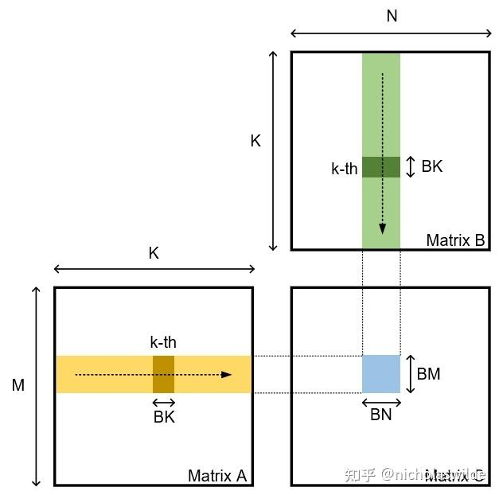

<!--
 * @Author: liu kang
 * @Date: 2024-11-28 23:07:02
 * @LastEditors: faaaade
 * @LastEditTime: 2024-12-04 23:40:26
 * @FilePath: \Notes\cuda\cuda-learn-note\hgemm.md
 * @Description: 
 * 
 * Copyright (c) 2024 by ${git_name_email}, All Rights Reserved. 
-->

# hgemm
[知乎](https://zhuanlan.zhihu.com/p/555339335)
[参考](https://developer.nvidia.com/blog/cutlass-linear-algebra-cuda/)

## 基本概念
```cpp
//需要声明matrix_a/matrix_b/accumulator这三种矩阵的fragment（一个fragment对应一个warp的所有线程的某一个或几个寄存器），

nvcuda::wmma::fragment<wmma::matrix_a, 16, 16, 16, half, wmma::row_major> frag_a;
nvcuda::wmma::fragment<wmma::matrix_b, 16, 16, 16, half, wmma::row_major> frag_a;
nvcuda::wmma::fragment<wmma::accumulator, 16, 16, 16, half> frag_c;


//使用load_matrix_sync和store_matrix_sync将矩阵写入寄存器或将矩阵写回shared memory或global memory，
//使用mma_sync来调用Tensor Core计算矩阵乘法

nvcuda::wmma::fill_fragment(frag_c, 0.0);
nvcuda::wmma::load_matrix_sync(frag_a, (shared memory or global memory pointer), (stride_a));
nvcuda::wmma::load_matrix_sync(frag_b, (shared memory or global memory pointer), (stride_b));
nvcuda::wmma::mma_sync(frag_c, frag_a, frag_b, frag_c);
nvcuda::wmma::store_matrix_sync((shared memory or global memory pointer), frag_c, (stride_c), wmma::mem_row_major);

```
## ptx 指令

wmma 指令
```cpp
// wmma.load
wmma.load.a.sync.aligned.layout.shape{.ss}.atype r, [p] {, stride};
wmma.load.b.sync.aligned.layout.shape{.ss}.btype r, [p] {, stride};
wmma.load.c.sync.aligned.layout.shape{.ss}.ctype r, [p] {, stride};

// wmma.store
wmma.store.d.sync.aligned.layout.shape{.ss}.type [p], r {, stride};

// wmma.mma
wmma.mma.sync.aligned.alayout.blayout.shape.dtype.ctype d, a, b, c; // fp16
wmma.mma.sync.aligned.alayout.blayout.shape.s32.atype.btype.s32{.satfinite} d, a, b, c; // int8 uint8
wmma.mma.sync.aligned.alayout.blayout.shape.f32.atype.btype.f32 d, a, b, c; // bf16
wmma.mma.sync.aligned.alayout.blayout.shape.f32.atype.btype.f32 d, a, b, c; // tf32
wmma.mma.sync.aligned.alayout.blayout.shape{.rnd}.f64.f64.f64.f64 d, a, b, c; // fp64
wmma.mma.sync.aligned.row.col.shape.s32.atype.btype.s32{.satfinite} d, a, b, c; // int4 uint4
wmma.mma.op.popc.sync.aligned.row.col.shape.s32.atype.btype.s32 d, a, b, c; // int1 
```

mma 指令
```cpp
// mma
mma.sync.aligned.m8n8k4.alayout.blayout.dtype.f16.f16.ctype d, a, b, c; // fp16
mma.sync.aligned.m16n8k8.row.col.dtype.f16.f16.ctype d, a, b, c; // fp16
mma.sync.aligned.m16n8k16.row.col.dtype.f16.f16.ctype d, a, b, c; // fp16
mma.sync.aligned.m16n8k4.row.col.f32.tf32.tf32.f32 d, a, b, c; // bf16 tf32
mma.sync.aligned.m16n8k8.row.col.f32.atype.btype.f32 d, a, b, c; // bf16 tf32
mma.sync.aligned.m16n8k16.row.col.f32.bf16.bf16.f32 d, a, b, c; // bf16 tf32
mma.sync.aligned.shape.row.col{.satfinite}.s32.atype.btype.s32 d, a, b, c; // int8 uint8
mma.sync.aligned.shape.row.col{.satfinite}.s32.atype.btype.s32 d, a, b, c; // int4 uint4
mma.sync.aligned.shape.row.col.s32.b1.b1.s32.bitOp.popc d, a, b, c; // int1

// load matrix
ldmatrix.sync.aligned.shape.num{.trans}{.ss}.type r, [p];
```
## example 

  
### naive hgemm
```cpp
//naive
//M = 256;N=256,K=256
//blockDim(256), gridDim(2,1)

__global__ void HGEMMAligned_V1(
    half *__restrict__ a, half* __restrict__ b, half* __restrict__ c, const int M, consg int N, const int K
){
    const int BM = 128;
    const int BN = 256;
    const int BK = 8;

    int bx = blockIdx.x;
    int by = blockIdx.y;
    int tid = threadIdx.x;
    int wid = tid >> 5; // tid/32

    const int APAD = 8;
    const int BPAD = 8;

    __shared__ half s_a[BM][BK+APAD];
    __shared__ half s_b[BK][BN+BPAD];

    wmma::fragment<wmma::matrix_a, 16, 16, 16, half, wmma::row_major> frag_a[2][4];
    wmma::fragment<wmma::matrix_b, 16, 16, 16, half, wmma::row_major> frag_b[2][4];
    wmma::fragment<wmma::accumulatro, 16, 16, 16, half> frag_c[4][4];

    #pragma unroll
    for(int i=0; i<4; i++){
        #pragma unroll
        for(int j=0; j<4; j++){
            wmma::fill_frament(frag_c[i][j], 0.0);
        }
    }

    int load_a_smem_m = (tid>>2) << 1; //(tid/4)*2
    int load_a_smem_k = (tid & 3)<<3; //(tid%4)*8
    int load_b_smem_k = (tid>>5)<<2; //(tid/32)*4
    int load_b_smem_n = (tid&31)<<3; //(tid%32)*8

    //为什么两个线程相差 8 因为 bk =8 

    //tid = 0；load_a_smem_m = 0, load_a_smem_k = 0,  load_b_smem_k = 0, load_b_smem_n = 0  
    //tid = 1; load_a_smem_m = 0, load_a_smem_k = 8,  load_b_smem_k = 0, load_b_smem_n = 8
    //tid = 2; load_a_smem_m = 0, load_a_smem_k = 16, load_b_smem_k = 0; load_b_smem-n = 16
    //tid = 3; load_a_smem_m = 0, load_a_smem_k = 24, load_b_smem_k = 0, load_b_smem_n = 24
    //tid = 4; load_a_smem_m = 2, load_a_smem_k = 0,  load_b_smem_k = 0, load_b_smem_n = 32
    //tid = 5; load_a_smem_m = 2, load_a_smem_k = 8,  load_b_smem_k = 0, load_b_smem_n = 40
    //tid = 6; load_a_smem_m = 2, load_a_smem_k = 16, load_b_smem_k = 0, load_b_smem_n = 48
    //...
    //...
    //tid=254;load_a_smem_m=  126,load_a_smem_k = 16, load_b_smem_k =28, load_b_smem_n = 240
    //tid=255;load_a_smem_m = 126,load_a_smem_k = 24, load_b_smem_k =28, load_b_smem_n = 248


    int load_a_gmem_m = by*BM + load_a_smem_m; 
    int load_b_gmem_b = bx*BN + load_b_smem_n;

    

    int load_a_gmem_addr = OFFSET(load_a_gmem_m, load_a_smem_k, K);
    int load_b_gmem_addr = OFFSET(load_b_gmem_k, load_b_gmem_n, N);

    //wid = tid>>5 
    //tid = 0;  wid=0; comp_c_frag_m=0; comp_c_frag_n=0
    //tid = 32; wid=1; comp_c_frag_m=1; comp_c_frag_n=0
    //tid = 64; wid=2; comp_c_frag_m=0, comp_c_frag_n=1
    //tid =128; wid=4; comp_c_frag_m=0, comp_c_frag_n=2
    //

    //tid =255; wid=7; comp_c_frag_m=1, comp_c_frag_n=3
    int comp_c_frag_m = wid & 1; //0,1
    int comp_c_frag_n = wid >> 1;//wid/2

    for(int bk =0; bk < K/BK; bk++){
        FLOAT4(s_a[load_a_smem_m  ][load_a_smem_k])=FLOAT4(a[load_a_gmem_addr  ]);
        FLOAT4(s_a[load_a_smem_m+1][load_a_smem_k])=FLOAT4(a[load_a_gmem_addr+K]);
        FLOAT4(s_b[load_b_smem_k  ][load_b_smem_n])=FLOAT4(b[load_b_gmem_addr  ]);
        FLOAT4(s_b[load_b_smem_k+1][load_b_smem_n])=FLOAT4(b[load_b_gmem_addr+N]);
        FLOAT4(s_b[load_b_smem_k+2][load_b_smem_n])=FLOAT4(b[load_b_gmem_addr+2*N]);
        FLOAT4(s_b[load_b_smem_k+3][load_b_smem_n])=FLOAT4(b[load_b_gmem_addr+3*N]);

        load_a_gmem_addr += BK;
        load_b_gmem_addr +=BK*N;

        __syncthreads();

        wmma::load_matrix_sync(frag_a[0][0], &s_a[comp_c_frag_m*64][0],BK+APAD);
        wmma::load_matrix_sync(frag_a[0][1], &s_a[comp_c_frag_m*64 + 16][0],BK+APAD);
        wmma::load_matrix_sync(frag)


    }


}


```