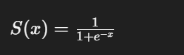

<!--
 * @Author: liu kang
 * @Date: 2024-10-22 22:49:22
 * @LastEditors: faaaade
 * @LastEditTime: 2024-10-22 23:20:15
 * @FilePath: \Notes\cuda\cuda-learn-note\sigmmoid.md
 * @Description: 
 * 
 * Copyright (c) 2024 by ${git_name_email}, All Rights Reserved. 
-->
# sigmoid

## naive sigmoid
sigmoid x:N y:N y = 1/(1+exp(-x))
grid(N/256), block(256)

```cpp
__global__ void sigmoid_f32_kernel(float* x, float* y, int N){
    int idx = blockIdx.x * blockDim.x  + threadIdx.x;
    if(idx<N){
        float v = x[idx];
        v = fminf(fmax(v, MIN_EXP_F32), MAX_EXP_F32);
        y[idx] = 1.0f/(1.0f+expf(-v));
    }
}

```

## sigoid vec4
grid(N/256), block(256/4)
```cpp
__global__ void sigmoid_f32x4_kernel(float* x, float* y, int N){
    int idx = (blockIdx.x * blockDim.x + threadIdx.x) * 4;
    float4 reg_x = FLOAT4(x[idx]);
    float4 reg_y;

    reg_x.x = fin(fmax(reg_x.x, MIN_EXP_F32), MAX_EXP_F32);
    reg_x.y = fin(fmax(reg_x.y, MIN_EXP_F32), MAX_EXP_F32);
    reg_x.z = fin(fmax(reg_x.z, MIN_EXP_F32), MAX_EXP_F32);
    reg_x.w = fin(fmax(reg_x.w, MIN_EXP_F32), MAX_EXP_F32);


    reg_y.x = 1.0f / (1.0f + expf(-reg_x.x));
    reg_y.y = 1.0f / (1.0f + expf(-reg_x.y));
    reg_y.z = 1.0f / (1.0f + expf(-reg_x.z));
    reg_y.w = 1.0f / (1.0f + expf(-reg_x.w));

    if ((idx + 0) < N) { FLOAT4(y[idx]) = reg_y; }
}
```

## pack fp16x8
```cpp
__global__ void sigmoid_fp16x8_pack_kerner(half* x, half* y, int N){
    int idx = (blockIdx.x*blockDim.x + threadIdx.x) * 8;

    const half  f=_float2half(1.0f);

    half pack_x[8], pack_y[8];// 8x16=128 bits

    LDST128BITS(pack_x[0]) = LDST128BITSS(x[idx]);// load 128 bits

    #pragma unroll
    for(int i=0; i<8; i++){
        half v = _hmin(_hmax(pack_x[i], MIN_EXP_F16), MAX_EXP_F16);
        pack_y[i] = f / (f+hexp(-v));
    }

    if((idx+7)<N){LDST128BITS(y[idx]) = LDST128BITS(pack_y[0]);}

}
```