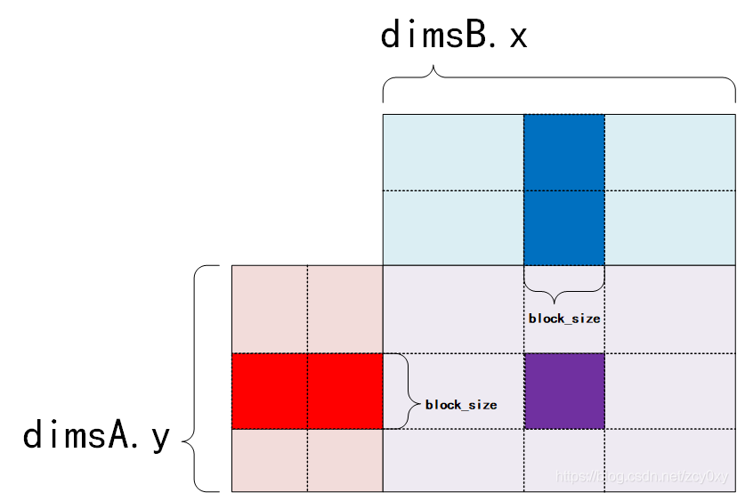
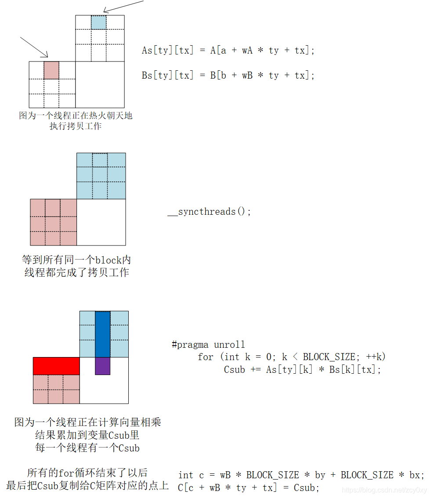

<!--
 * @Author: liu kang
 * @Date: 2024-10-10 23:48:37
 * @LastEditors: faaaade
 * @LastEditTime: 2024-10-11 23:25:47
 * @FilePath: \Notes\cuda\cuda-sample\matrixmul.md
 * @Description: cuda sample matrixMul
 * 
 * Copyright (c) 2024 by ${git_name_email}, All Rights Reserved. 
-->
# [MatrixMul](https://blog.csdn.net/zcy0xy/article/details/84532826)
  


  

```cpp
    for (int a = aBegin, b = bBegin;
         a <= aEnd;
         a += aStep, b += bStep)
    {

		// 共享内存，线程访问起来更快，同一个block共享同一个block
        __shared__ float As[BLOCK_SIZE][BLOCK_SIZE];
        __shared__ float Bs[BLOCK_SIZE][BLOCK_SIZE];
        As[ty][tx] = A[a + wA * ty + tx];
        Bs[ty][tx] = B[b + wB * ty + tx];

        //同步，等待同一个block的所有线程都完成了上一步，才会继续
		//因为必须保证数据都复制到As，Bs里去了才能操作计算他们
        __syncthreads();

        // #pragma unroll 这个语法就是把for循环在编译时手动展开
		//如果for循环次数比较少，可以这么做加快速度
#pragma unroll
        for (int k = 0; k < BLOCK_SIZE; ++k)
        {
            Csub += As[ty][k] * Bs[k][tx];
        }

        __syncthreads();
    }

    int c = wB * BLOCK_SIZE * by + BLOCK_SIZE * bx;
    C[c + wB * ty + tx] = Csub;
 
```
自己手撸一遍加深印象吧
```cpp
template<int BLOCK_SIZE> __global_ void MatrixMulCUDA(float *C, float *A, float* B, int wA, int wB ){
    //blokc index
    int bx = blockIdx.x;
    int by = blockIdx.y;

    //thread index
    int tx = threadIdx.x;
    int ty = threadIdx.y;

    //计算每个 A 矩阵子矩阵的 起始位置
    int aBegin = wA * BLOCK_SIZE * by;
    int aEnd = aBegin + wA - 1;
    int aStep = BLOCK_SIZE;

    //计算每个 B 矩阵子矩阵 起始位置
    int bBegin = BLOCK_SIZE * bx;
    int bStep =  BBLOCK_SIZE * wB;

    float Csub = 0;

    for(int a=aBegin, b=bBegin; a<=aEnd;a+=aStep, b+=bStep){

        __shared__ float As[BLOCK_SIZE][BLOCK_SIZE];
        __shared__ float Bs[BLOCK_SIZE][BLOCK_SIZE];


        As[ty][tx] = A[ a+ wA*ty+tx];
        Bs[ty][tx] = B[a + wB*ty+tx];


        __syncthreads();

        #pragma unroll

        for(int k=; k<BLOCK_SIZE; ++k){
            Csub += As[ty][k]+Bs[k][tx];
        }

        __syncthreads();
        
    }

    int c = wB*BLOCK_SIZE*by + BLOCK_SIZE*bx;
    C[c+wB*ty+tx] = Csub;

}
```