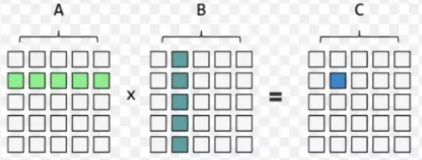
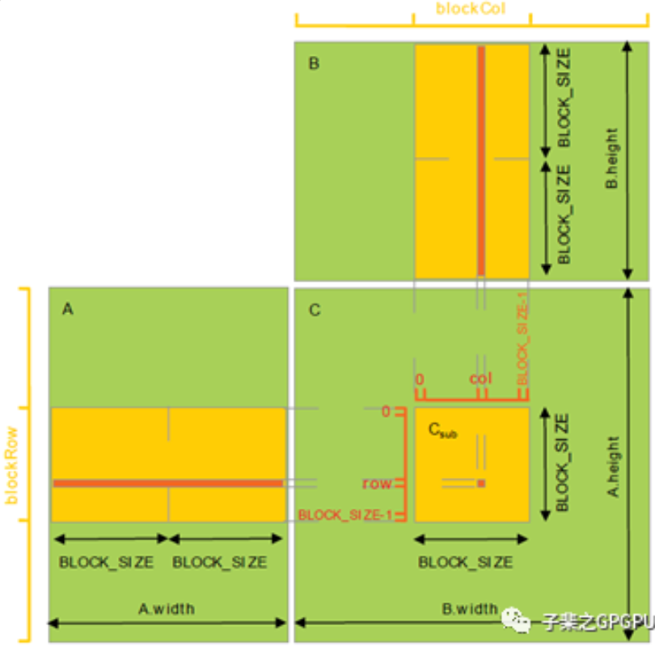

# [gemm](https://chiemon.github.io/2020/02/06/CUDA-%E7%9F%A9%E9%98%B5%E4%B9%98%E6%B3%95-%E4%BC%98%E5%8C%96%E5%8F%8A%E6%80%A7%E8%83%BD%E5%88%86%E6%9E%90-%E4%B8%8A.html)

C_out[m, n]
A_in [m, k]
B_in [k, n]
C_out = A_in * B_in
## cpu 实现
```cpp
//m=3, n=2, k=2
//A(3X2)[[0, 1],
//       [2, 3],
//       [4, 5]]
//B(2X2)[[9, 10],
//       [11, 12]]
//C[i,j] = A[i,0]*B[j*k]
//
void cpu_gemm(vector<vector<int>>& A, vector<vector<int>>& B, vector<vector<int>>& C, int m, int n , int k){
    for(int i=0; i<m ;i++){
        for(int j=0; j<n ; j++){
            int rest=0;
            for(int z=0; z<k; ++z){
                res+=A[i,z]*B[z,j];
            }
            C[i,j] = res;
        }
    }
}
//c[i,j] = a[i,0]*b[0,j] + a[i,1]*b[1,j]+ ... + a[i,k]*b[k,j]
void cpu_gemm(float* A, float* B, float* C, int m, int n, int k){
    for(int i=0; i<m; i++){
        for(int j=0; j<n; j++){
            float res = 0.0f;
            for(int z=0; z<k ; z++){
                res+=A[i*k+z]*B[z*n+j]
            }
            C[i*n+j] = res;
            res = 0.0f;
        }
    }
}
```
## gpu 实现 global memory
```cpp
//每个线程处理一行数据
__global__ void matrixMulGlobalKernel(float* pfMatrixA, float* pfMatrixB, float* pfMatrixC, int m, int n, int k){
    //row 代表行
    int nRow  = blockIdx.y*blockDim.y + threadIdx.y;// 行
    int nCol  = blockIdx.x*blockDim.x + threadIdx.x;// 列
    float fCVal = 0.0f;

    for(int i=0; i<k; i++){
        fCVal+=pfMatrixA[nRow*k+i]*pfMatrixB[i*n+nCol]
    }
    pfMatrixC[nRow*n+nCol] = fCVal;

}
```
## gpu 实现共享内存版

```cpp
//把小块数据从全局内存读到共享内存中
//从共享内存读到寄存器中
__global__ void matrixMulSharedKernel_opl(float* fpMatrixA, float* fpMatrixB, float* fpMatrixC, int m, int n, int k){
   
   //C[i,j] = A[i,0]*B[0,j] + A[i,1]*B[1,j] + ... +A[i,k]*B[k,j]
   
    //全局内存中每个元素的行索引
    int nRow = blockIdx.y*blockDim.y + threadIdx.y;
    //全局内存中每个元素的列索引
    int nCol = blockIdx.x*blockDim.x + threadIdx.x;
    float fcVal = 0.0f;


    //从全局内存拷到共享内存
    
    //设置共享内存块大小
    __shared__ float shTileA[BLOCK_SIZE][BLOCK_SIZE];
    __shared__ float shTileB[BLOCK_SIZE][BLOCK_SIZE];

    int nIter = (k+BLOCK_SIZE-1)/BLOCK_SIZE;//向上取整

    for(int i=0; i<nIter; i++){
        //数据从全局内存拷到共享内存
        shTileA[threadIdx.y][threadIdx.x] = fpMatrixA[nRow*k + i*BLOCK_SIZE+ threadIdx.x];
        shTileB[threadIdx.y][threadIdx.x] = fpMatrixB[(i*BLOCK_SIZE+threadIdx.y)*n + nCol];

        //等待所有数据从全局内存读到共享内存中
        __syncthreads();

        // sub-matrix mutilpy
        for(int l=0; l<BLOCK_SIZE; l++){
            fCVal+= shTileA[threadIdx.y][l]*shTileB[l][threadIdx.x];
        }

        __suncthreads();

        fpMatrix[nRow*n+nCol] = fCVal;

    }
}

//如何避免 bank conflict
//内存 padding, 改变数据布局， 使用 shuffle 指令
__global__ void avoidBankConflict(float *data){
    __shared__ float sharedData[32*32+32]; //增加填充
    int tid = threadIdx.x;
    int index = tid*33

    sharedData[index] = data[tid];

    __syncthread();
    data[tid] = sharedData[index];
}

```
## Register 优化
```cpp
//每个线程一次只取 8Byte 的数据
__global__ void matrixMulSharedILPkernel(float*  fpMatrixA, float* fpMatrixB, float* fpMatrixC, int m, int n, int k){
   //每次读两行数据，一列数据
    int row = blockIdx.y*blockDim.y*2 + threadIdx.y;
    int col = blockIdx.x*blockDim.x  + threadIdx.x;

    float val[2] = {0.0f};

    __shared__ float shTileA[BLOCK_SIZE][BLOCK_SIZE];
    __shared__ float shTileB[BLOCK_SIZE][BLOCK_SIZE];

    int iter = (k+BLOCK_SIZE-1) / BLOCK_SIZE;

    for(int i=0; i < iter; i++){
        shTileA[threadIdx.y][threadIdx.x] = fpMatrixA[row*k + i*BLOCK_SIZE + threadIdx.x];
        shTileA[threadIdx.y+16][threadIdx.x] = fpMatrixA[(row+16)*k + i*BLOCK_SIZE + threadIdx.x];

        shTileB[threadIdx.y][threadIdx.x] = fpMatrixB[(i*BLOCK_SIZE + threadIdx.y)*n + col];
        shTileB[threadIdx.y + 16][threadIdx.x] = fpMatrixB[(i*BLOCK_SIZE + threadIdx.y + 16)*n + col];

        __syncthreads();

        for(int j=0; j<BLOCK_SIZE; j++){
            val[0] += shTileA[threadIdx.y][j] * shTileB[j][threadIdx.x];
            val[1] += shTileA[threadIdx.y+16][j] * shTileB[j][threadIdx.x];
        }

        __syncthreads();
    }
    fpMatrixC[row*n+col] = val[0];
    fpMatrixC[(row+16)*n + col] = val[1];
}
```