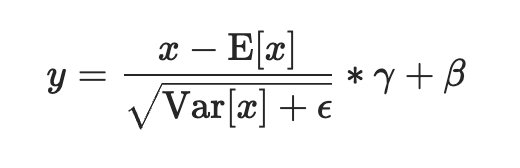
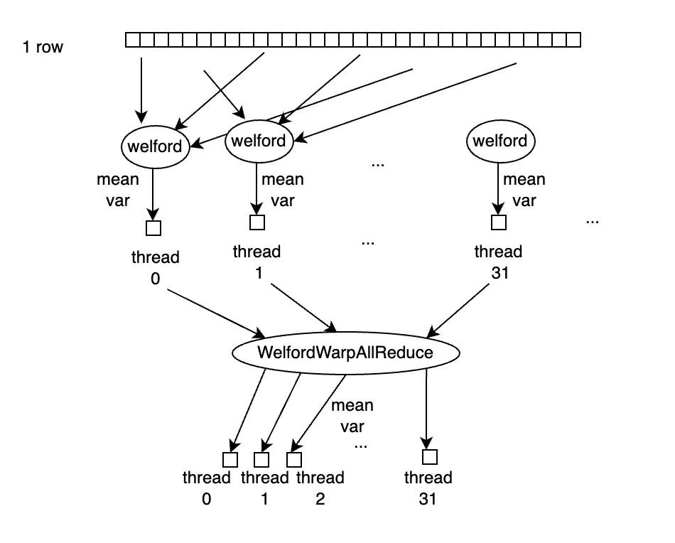

<!--
 * @Author: liu kang
 * @Date: 2024-06-22 23:24:34
 * @LastEditors: fade
 * @LastEditTime: 2024-06-22 23:24:34
 * @FilePath: \Notes\cuda\oneflow\layernorm.md
 * @Description: 
 * 
 * Copyright (c) 2024 by ${git_name_email}, All Rights Reserved. 
-->
## [layer norm](https://mp.weixin.qq.com/s?__biz=MzU5ODY2MTk3Nw==&mid=2247486307&idx=1&sn=71ed328371124d59c69298b54725aa1f&chksm=fe418555c9360c4376d62799df3cfdbddfb62d020016056f3d366c427adef64ee8d2d17f9393&cur_album_id=1680032651186864138&scene=190#rd)


  

### 1. num_cols <= 1024 的情况
  
```cpp
template<typename T, int thread_group_width = kWarpSize>
__inline__ __device__ void WelfordWarpReduce(T thread_mean, T thread_m2, T thread_count, T* mean, T* m2, T* count) {
  *mean = thread_mean;
  *m2 = thread_m2;
  *count = thread_count;
  for (int mask = thread_group_width / 2; mask > 0; mask /= 2) {
    T b_mean = __shfl_down_sync(0xffffffff, *mean, mask);
    T b_m2 = __shfl_down_sync(0xffffffff, *m2, mask);
    T b_count = __shfl_down_sync(0xffffffff, *count, mask);
    WelfordCombine(b_mean, b_m2, b_count, mean, m2, count);
  }
}

template<typename T, int thread_group_width = kWarpSize>
__inline__ __device__ void WelfordWarpAllReduce(T thread_mean, T thread_m2, T thread_count, T* mean, T* m2, T* count) {
  WelfordWarpReduce<T, thread_group_width>(thread_mean, thread_m2, thread_count, mean, m2, count);
  *mean = __shfl_sync(0xffffffff, *mean, 0, thread_group_width);
  *m2 = __shfl_sync(0xffffffff, *m2, 0, thread_group_width);
  *count = __shfl_sync(0xffffffff, *count, 0, thread_group_width);
}
```