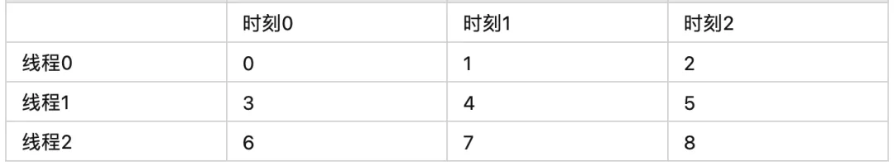
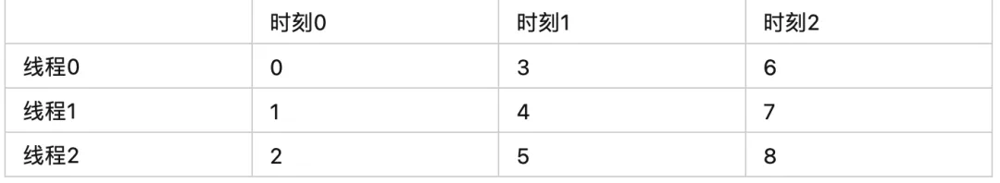

## [reduce](https://mp.weixin.qq.com/s?__biz=MzU5ODY2MTk3Nw==&mid=2247486069&idx=2&sn=dce0bf996934fd4ea24e731ce118ba3c&chksm=fe418443c9360d55b0a1dc82cac5b0de1a3caf77d3724939d50c91ff731bda7b2a5cfdf3a71f&cur_album_id=1680032651186864138&scene=190#rd)

### naive
```cpp
__global__ void SerialKernel(const float* input, float* output, size_t n) {
  float sum = 0.0f;
  for (size_t i = 0; i < n; ++i) {
    sum += input[i];
  }
  *output = sum;
}

void ReduceBySerial(const float* input, float* output, size_t n) {
  SerialKernel<<<1, 1>>>(input, output, n);
}
```
#### two pass
```cpp
__global__ void TwoPassSimpleKernel(const float* input, float* part_sum,
                                    size_t n) {
  // n is divided to gridDim.x part
  // this block process input[blk_begin:blk_end]
  // store result to part_sum[blockIdx.x]
  size_t blk_begin = n / gridDim.x * blockIdx.x;
  size_t blk_end = n / gridDim.x * (blockIdx.x + 1);
  // after follow step, this block process input[0:n], store result to part_sum
  n = blk_end - blk_begin;
  input += blk_begin;
  part_sum += blockIdx.x;
  // n is divided to blockDim.x part
  // this thread process input[thr_begin:thr_end]
  size_t thr_begin = n / blockDim.x * threadIdx.x;
  size_t thr_end = n / blockDim.x * (threadIdx.x + 1);
  float thr_sum = 0.0f;
  for (size_t i = thr_begin; i < thr_end; ++i) {
    thr_sum += input[i];
  }
  // store thr_sum to shared memory
  extern __shared__ float shm[];
  shm[threadIdx.x] = thr_sum;
  __syncthreads();
  // reduce shm to part_sum
  if (threadIdx.x == 0) {
    float sum = 0.0f;
    for (size_t i = 0; i < blockDim.x; ++i) {
      sum += shm[i];
    }
    *part_sum = sum;
  }
}
void ReduceByTwoPass(const float* input, float* part_sum, float* sum,
                     size_t n) {
  const int32_t thread_num_per_block = 1024;  // tuned
  const int32_t block_num = 1024;             // tuned
  // the first pass reduce input[0:n] to part[0:block_num]
  // part_sum[i] stands for the result of i-th block
  size_t shm_size = thread_num_per_block * sizeof(float);  // float per thread
  TwoPassSimpleKernel<<<block_num, thread_num_per_block, shm_size>>>(input, part, n);
  // the second pass reduce part[0:block_num] to output
  TwoPassSimpleKernel<<<1, thread_num_per_block, shm_size>>>(part, output,block_num);
}

```
#### 合并访存
two pass 模式

合并访存后的内存布局

```cpp
__global__ void TwoPassInterleveKernal(const float* input, const float * output, )

```