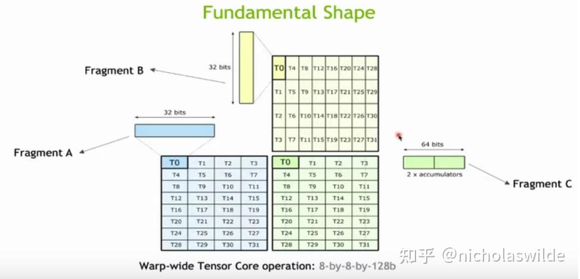

<!--
 * @Author: liu kang
 * @Date: 2024-11-06 21:20:29
 * @LastEditors: faaaade
 * @LastEditTime: 2024-11-09 16:14:41
 * @FilePath: \Notes\cuda\tensore_gemm.md
 * @Description: gemm by tensore
 * 
 * Copyright (c) 2024 by ${git_name_email}, All Rights Reserved. 
-->
#hgemm
[hgemm](https://zhuanlan.zhihu.com/p/555339335)
  
](image-2.png)
```cpp
//BM = 128
//BN =256
//BK = 32
__global__ void myHGEMMAlignedV1(
    half * __restrict__ a, half * __restrict__ b, half *     __restrict__ c,    const int M, const int N, const int K){

        const int BM = 128;
        const int BN = 256;
        const int BK = 32;

        int bx = blockIdx.x;
        int by = blockIdx.y;
        int tid = threadIdx.x;
        int wid = tid>> 5;

        const int APAD = 8;
        const int BPAD = 8;

        __shared__ half s_a[BM][BK+APAD];
        __shared__ half s_b[BK][BN+BPAD];

        wmma::fragment<wmma::matrix_a, 16, 16, 16, half, wmma::row_major> frag_a[2][4];
        wmma::fragment<wmma::matrix_b, 16, 16, 16, half, wmma::row_major> frag_b[2][4];
        wmma::fragment<wmma::accumulator, 16, 16, 16, half> frag_c[4][4];

        #pragma unroll
        for(int i=0; i<4; i++){
            #pragma unroll
            for(int j=0; j<4; j++){
                wmma::fill_fragment(frag_c[i][j], 0.0);
            }
        }

        int load_a_smem_m = (tid>>2) << 1;
        int load_a_smem_k = (tid&3)  <<3;
        int load_b_smem_k =(tid >> 5) <<2;
        int load_b_smem_n = (tid & 31) << 3;

        int load_a_gmem_m = by * BM + load_a_smem_m;
        int load_b_gmem_n = bx * BN + load_b_smem_n;

        int load_a_gmem_addr = OFFSET(load_a_gmem_m, load_a_smem_k, K);
        int load_b_gmem_addr = OFFSET(load_b_smem_k, load_b_gmem_n, N);

        int comp_c_frag_m = wid & 1;
        int comp_c_frag_n = wid >> 1;

        for(int bk =0; bk < K/BK ;bk++){
            FLOAT4(s_a[load_a_smem_m    ][load_a_smem_k]) = FLOAT4(a[load_a_gmem_addr]);
            FLOAT4(s_a[load_a_smem_m + 1][load_a_smem_k]) = FLOAT4(a[load_a_gmem_addr + k]));
            
        }

    }

```