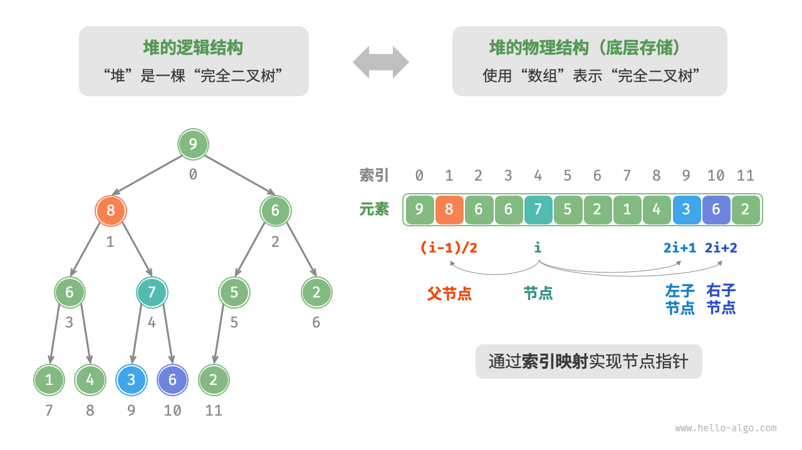

# [8.1 堆](https://www.hello-algo.com/chapter_heap/heap/)

堆是满足特定条件的完全二叉树

* 小顶堆 任意节点的值<其子节点的值
* 大顶堆 任意节点的之>其子节点的植

## 8.1.1 堆的常用操作

```cpp
//初始化小顶堆
priority_queue<int , vector<int>, greater<int>> minHeap;
//初始化大顶堆
priority_queue<int , vector<int>, less<int>> maxHeap;
// 元素入堆
maxHeap.push(1);
maxHeap.push(2);
maxHeap.push(3);

//获取堆顶元素
int peek = maxHeap.top()

//堆顶元素出堆
maxHeap.pop();
maxHeap.pop();
maxHeap.pop();

//获取堆的大小
int size = maxHeap.size();

//输入列表并建堆
vector<int> input{1,3,,2,5,4};
priority_queue<int, vector<int>, greater<int>> minHeap(input.begin(), input.end());

```

## 8.1.2 堆的实现

1. 堆的存储与表示
   

```cpp
int left(int i){
    return 2*i +1;
}
int right(int i){
    return 2*i + 2;
}
//获取父节点
int parent(int i){
    return(i-1)/2;
}
```

2. 访问堆顶元素

```cpp
int peek(){
    return maxHeap[0];
}
```

3. 元素入堆

```cpp
void push(int val){
    maxHeap.push_back(val);
    siftUp(size()-1);
}
void siftUp(int i){
    while(true){
        int p = parent(i);
        if(p<0 || maxHeap[i]<=maxHeap[p])
            break;
        swap(maxHeap[i], maxHeap[p]);
        i = p;
    }
}

```

4. 堆顶元素出栈

```cpp
// 元素出堆
void pop(){
    if(isEmpty())
        throw out_of_range("堆为空")；
    swap(maxHeap[0], maxHeap[size()-1]);
    maxHeap.pop_back();
    siftDown(0);
}
void siftDown(int i){
    while(true){
        int l= left(i), r right[i], ma = i;
        if(l<size() && maxHeap[l] > maxHeap[ma])
            ma = l;
        if(r<size() && maxHeap[r] > maxheap[ma])
            ma = r;
        if(ma == i)
            break;
        swap(maxHeap[i], maxHeap[ma]);
        i = ma;

    }

}

```

## 101

```cpp
//                                       100
//                                      /   \
//                                     19    36
//                                     / \   / \
//                                    17  3 25  1
//                                   / \
//                                  2   7
//大顶堆
//
vector<int> headp;

//上浮
void swim(int pos){
    while(pos>0 && heap[(pos-1)/2] < heap[pos]){
        swap(heap[(pos-1)/2], heap[pos]);
        pos = (pos-1)/2;
    }
}

void sink(int pos){
    while(2*pos + 1 <= N){
        int i=2*pos + 1                                                              ;
        if(i<N && heap[i]<heap[i+1]) ++i；
        if(heap[pos]>=heap[i]) break;
        swap(heap[pos], heap[i]);
        pos = i;
    }
}

void push(int k){
    heap.push_back(k);
    swim(heap.size() -1);
}

void pop(){
    heap[0] = heap.back();
    heap.pop_back();
    sink(0);
}

int top(){
    return heap[0];
}


23. Merge K Sorted Lists

struct Comp{
    bool operator()(ListNode*  l1, ListNoe* l2){
        return l1->val > l2->val;
    }
}

ListNode* mergeKLists(vector<LisntNode*>& lists){
    if(lists.empty()) return nullptr;
    priority_queue<ListNode* ,vector<ListNode*>, Comp> q;
    for(ListNode* list:lists){
        if(list){
            q.push(list);
        }
    }
    ListNode* dummy = new ListNode(0), *cur = dummy;
    while(!q.empty()){
        cur->next = q.top();
        q.pop();
        cur = cur->next;
        if(cur->next){
            q.push(cur->next);
        }
    }
    return dummy->next;
}

//218 The Skyline Problem
vector<vector<int>> getSkyline(vector<vector<int>>& buildings){
    vector<vector<int>> ans;
    priority_queue<pair<int, int>> max_heap;// 高度，右端
    int i=0, len = buildings.size();
    int cur_x, cur_h;
    while(i<len || !max_heap.empty()){
        if(max_heap.empty() || i<len && buildings[i][0] <= max_heap.top().second){
            cur_x = buildings[i][0];
            while(i<len && cur_x == buildings[i][0]){
                max_heap.emplace(buildings[i][2], buildings[i][1]);
                ++i;
            }
        }else{
            cur_x = max_heap.top().second;
            while(!max_heap.empty() && cur_x>=max_heap.top().second){
                max_heap.pop();
            }
        }
        cur_h = (max_heap.empty() ? 0 : max_hea.top().first);
        if(ans.empty() || cur_h != ans.back()[i]){
            ans.push_back({cur_x, cur_h});
        }
    }
    return ans;

}
```
