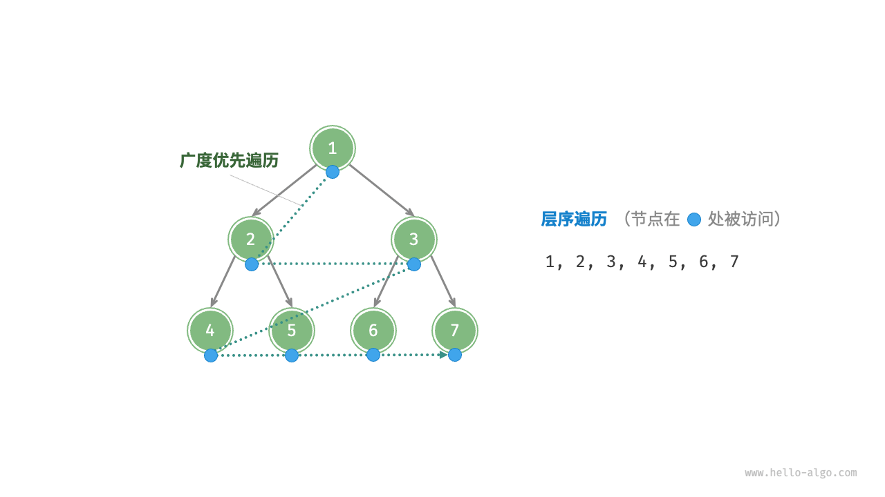
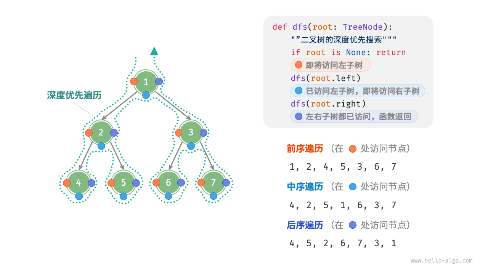
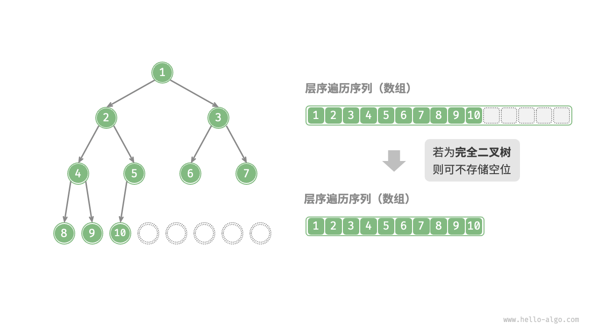

[数据结构之树](https://www.hello-algo.com/chapter_tree/binary_search_tree/#__tabbed_4_3)

[树的遍历方式](https://blog.csdn.net/qq_37891889/article/details/88602139)

前序遍历

```cpp
typedef struct Node{
	char data;
	struct Node* lchild, rchild;
}Node;
# 创建树
void  creatTree(Node* &root){
	char data;
	cin >> data;
	if(data=="#"){
		root = NULL;
	}
	else
	{
		root = new Node;
		root->data = data;
		create(root->lchild);
		create(root->rchild);
	}
}

//打印一个节点的数据
void visit(Node* node){
	if(node!=NULL)
		cout<<node->data;
}

//递归 前序遍历
void midTraversal(Node* root){

}

```

## 7.1二叉树

```cpp
struct TreeNode{
	int val;
	TreeNode *left;
	TreeNode *right;
	TreeNode(int x):val(x), left(nullptr), right(nullptr){}
};
```

7.1.1二叉树常见术语

7.1.2二叉树基本操作

1.初始化二叉树

```cpp
TreeNode* n1 = new TreeNode(1);
TreeNode* n2 = new TreeNode(2);
TreeNode* n3 = new TreeNode(3);
TreeNode* n4 = new TreeNode(4);
TreeNode* n5 = new TreeNode(5);
//构建节点之间的引用
n1->left = n2;
n1->right =n3;
n2->left = n4;
n2->right = n5;

//插入与删除节点
TreeNode* P=new TreeNode(0);
//在n1->n2中插入节点p
n1->left = P;
P->left = n2;
//删除节点
n1-left = n2;
```

## 7.2 二叉树遍历

### 7.2.1 层序遍历

从顶部到底部逐层遍历二叉树，并在每一层按照从左到右的顺序访问节点



#### 代码实现

```cpp
/*层序遍历*/
vector<int> levelOrder(TreeNode *root){
	//出示化队列，加入根节点
	queue<TreeNode *> queue;
	queue.push(root);
	// 初始化一个列表，用于保存遍历顺序
	vector<int> vec;
	while(!queue.empty()){
		TreeNode *node = queue.front();
		queue.pop();
		vec.push_back(node->val);
		if(node->left!=nullptr)
			queue.push(node->left);
		if(node->right!=nullptr)
			queue.push(node->right);
	}
	return vec;
}

```

### 7.2.2 前序，中序，后续遍历



```cpp
//前序遍历
void preOrder(TreeNode *root){
	if(root==nullptr)
		return;
	vec.push_back(root->val);
	preOrder(root->left);
	preOrder(root->right);
}
//中序遍历
void inOrder(TreeNode *root){
	if(root==nullptr)
		return;
	inOrder(root->left);
	vec.push_back(root->val);
	inOrder(root->right);
}
//后序遍历
void postOrder(TreeNode *root){
	if(root==nullptr)
		return;
	postOrder(root->left);
	postOrder(root->right);
	vec.push_back(root->val);
}

```

## 7.3 二叉数组表示

### 7.3.1 表示完美二叉树

### 7.3.2 表示任意二叉树



```cpp
class ArrayBinaryTree{
	public:
		ArrayBinaryTree(vector<int> arr){
			tree = arr;
		}
		/*节点数量*/
		int size(){return tree.size();}
		//获取索引为i的节点
		int val(int i){
			if(i<0 || i>=size())
				return INT_MAX;
			return tree[i];
		}
		//获取索引为i节点的左子节点的索引
		int left(int i){return 2*i+1;}
		int right(int i){return 2*i+2;}
		//获取索引为i节点的父节点索引
		int parent(int i){return (i-1)/2;}
		//层序遍历
		vector<int> levelOrder(){
			vector<int> res;
			for(int i=0; i<size(); i++){
				if(val(i)!=INT_MAX)
					res.push_back(val(i));
			}
			return res;
		}
		vector<int> preOrder(){
			vector<int> res;
			dfs(0, "pre", res);
			return res;
		}
		vector<int> inOrder() {
        	vector<int> res;
        	dfs(0, "in", res);
        	return res;
    	}
		vector<int> inOrder() {
        	vector<int> res;
        	dfs(0, "post", res);
        	return res;
    	}
	private:
		vector<int> tree;
		void dfs(int i, string order, vector<int> &res){
			if(val(i)==INT_MAX)
				return;
			if(order == "pre")
				res.push_back(val(i));
			dfs(left(i), order, res);
				//中序遍历
			if(order == "in")
				res.push_back(val(i));
			dfs(right(i), order, res);
			if(order == "post)
				res.push_back(val(i));
		}

}
```

## 7.4 二叉搜索树

对于根节点，左子树中所有节点的值<根节点的值<右子树中所有节点的值

### 7.4.1 二叉搜索树的操作

1. 查找节点

```cpp
TreeNode *search(int num){
	TreeNode 8cyr = root;
	while(cur!=nullptr){
		if(cur->val < num)
			cur = cur->right;
		else if (cur->val > num)
			cur = cur->left;
		else
			break;
	}
	return cur;
}
```

2. 插入节点

```cpp
void insert(int num){
	if(root ==nullptr){
		root = new TreeNode(num);
		return;
	}
	TreeNode *cur= root, *pre = nullptr;
	while(cur != nullptr){
		if(cur->val ==num)
			return;
		pre = cur;
		if(cur->val < num>)
			cur = cur->right;
		else
			cur = cur->left;	
	}
	TreeNode *node = new TreeNode(num);
	if(pre->val < num )
		pre->right = node;
	else
		pre->left = node;

}
```

3. 删除节点
* 节点度为 0
* 节点度为 1
* 节点度为 2
```cpp
void remove(int num){
	if (root == nullptr)
		return;
	TreeNode *cur = root, *pre = nullptr;
	while(cur != nullptr){
		if(cur->val == num)
			break;
		pre = cur;
		if(cur->val < num)
			cur = cur->right;
		else
			cur = cur->left;
	}
	if(cur == nullptr)
		return;
	// 子节点的度数 = 0 or 1
	if(cur->left == nullptr || cur->right == nullptr){
		TreeNode *child = cur->left!=nullptr : cur->right;
		if(cur !=root){
			if(pre->left == cur)
				pre->left = child;
			else
				pre->right = child;
		}else{
			root = child;
		}
		delete cur;
	}else{
		TreeNode *tmp = cur->right;
		while(tm->left != nullptr){
			tmp = tmp->left;
		}
		int tmpVal = tmp->val;
		remove(tmp->val);
		cur->val = tmpVal;
	}
}
```
4. 中序遍历有序