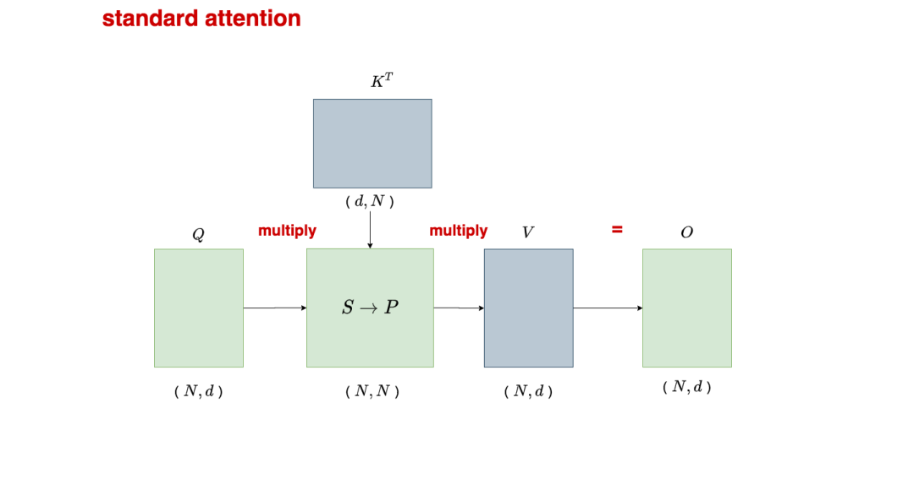
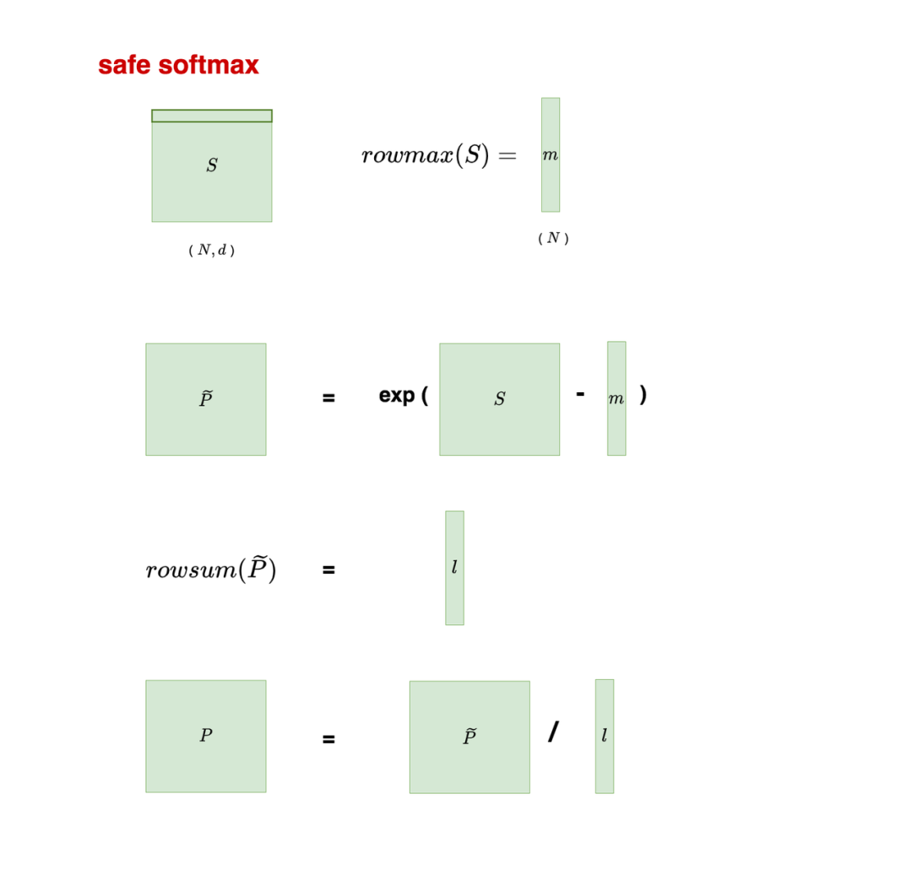
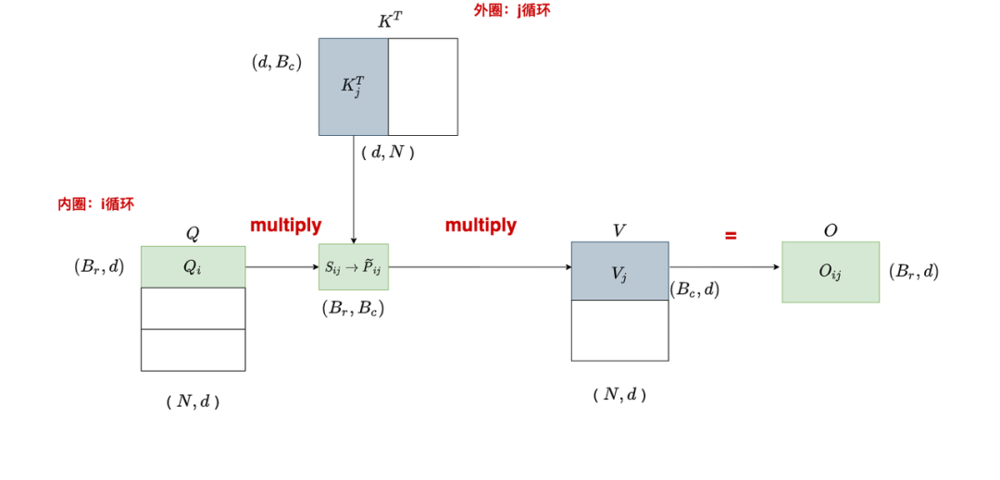
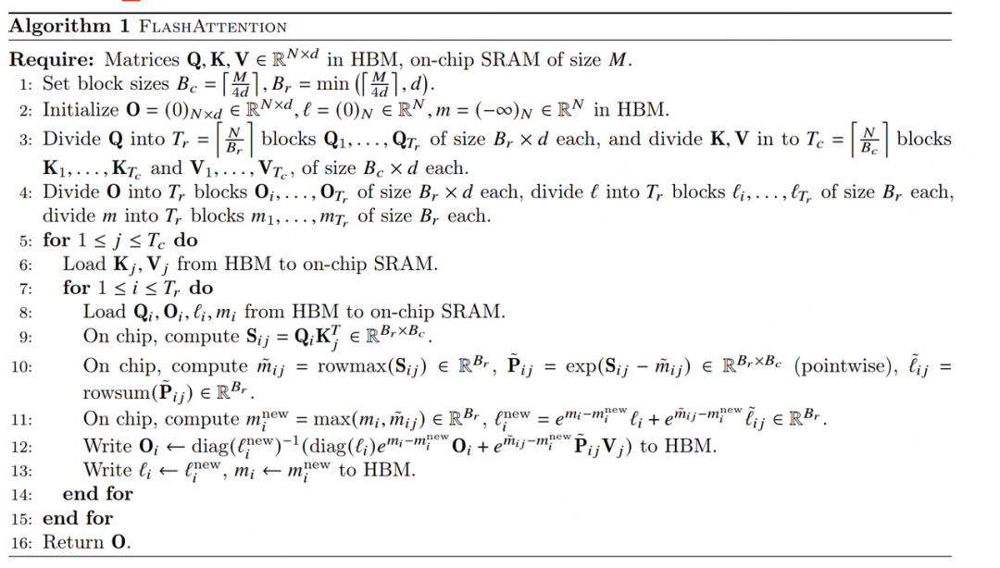

<!--
 * @Author: liu kang
 * @Date: 2024-10-13 17:54:39
 * @LastEditors: faaaade
 * @LastEditTime: 2024-10-13 23:57:40
 * @FilePath: \Notes\llm\flashattention.md
 * @Description: 
 * 
 * Copyright (c) 2024 by ${git_name_email}, All Rights Reserved. 
-->

# flash attention 系列

[v1](https://www.cvmart.net/community/detail/8245)
[v2](https://blog.csdn.net/qq_27590277/article/details/136181185)
[v3]()

## [v1](https://www.cvmart.net/community/detail/8245)

### attention 原理图

### safe soft max 原理图

## flash attention 计算流程图

1. Q 划分

算法流程图

