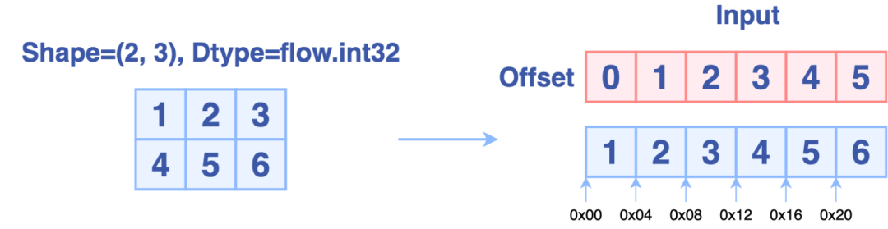
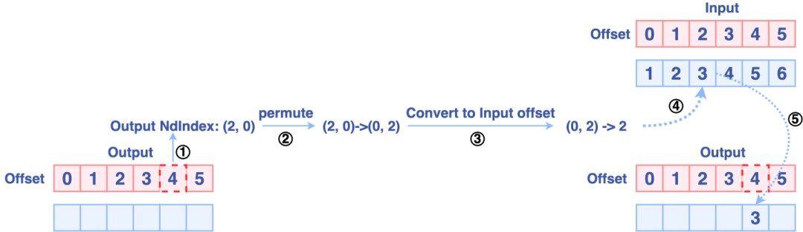
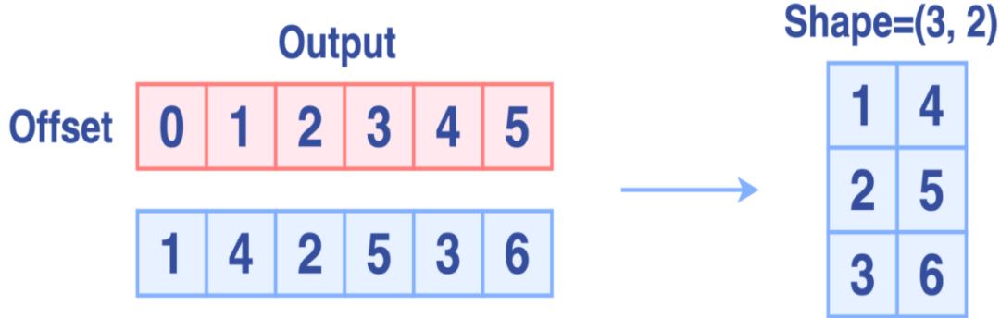

# [transpose](https://cloud.tencent.com/developer/article/1900541)

## 原理


**OneFlow的Permute实现原理为：**
通过当前输出的一维偏移量(offset)计算对应的高维索引
然后根据参数dims重新排列输出索引，进而得到输入索引。
将输入索引转换成输入偏移量
最后进行数据移动，整个过程的示意图如下：

输出


## one flow 实现

NdIndexOffsetHelper

```cpp
template<size_t num_dims, size_t movement_size, typename IndexType>
__global__ void PermuteKernel(PermuteKernelParams<num_dims, IndexType> params) {
  using T = typename std::aligned_storage<movement_size, movement_size>::type;
  const T* src = reinterpret_cast<const T*>(params.src);
  T* dst = reinterpret_cast<T*>(params.dst);
  IndexType src_index[num_dims];
  IndexType dst_index[num_dims];
  CUDA_1D_KERNEL_LOOP_T(IndexType, i, params.count) {
    params.dst_index_helper.OffsetToNdIndex(i, dst_index);
#pragma unroll
    for (size_t dim = 0; dim < num_dims; ++dim) {
      src_index[params.permutation[dim]] = dst_index[dim];
    }
    IndexType src_offset = params.src_index_helper.NdIndexToOffset(src_index);
    dst[i] = src[src_offset];
  }
}
```
## [参考 2](https://code.hitori.moe/post/cuda-transpose-optimization/)

