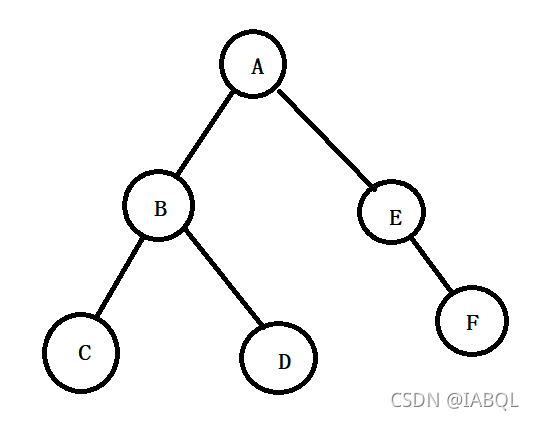

## log
### 树
```cpp
// path sum
int pathSum(TreeNode* root, int sum){
    return root ? pathSumStartWithRoot(root, sum) + pathSum(root->left, sum) + pathSum(root->right, sum) : 0;
}

long long pathSumStartWithRoot(TreeNode* root, long long sum){
    if(!root){
        return 0;
    }
    long long count = root->val == sum ? 1:0;
    count += pathSumStartWithRoot(root->left, sum-root->val);
    count += pathSumStartWithRoot(root->right,sum-root->val);
    return count;
}

// 101 Symmetric Tree
bool isSymmetric(TreeNode *root){
    return root ? isSymmetric(root->left, root->right) : true;
}
//辅函数
bool isSymmetric(TreeNode8 left, TreeNode* right){
    if(!left && !right){
        return true;
    }
    if(!left || !!right){
        return false;
    }
    if(left->val != right->val){
        return false;
    }
    return isSymmetric(left->left, right->right) && isSymmetric(left->right, right->left);
}

//delete Nodes and return forest
vector<TreeNode*> delNode(TreeNode* root, vector<int>& to_delete){
    vector<TreeNode*> forest;
    unordered_set<int> dict(to_delete.begin(), to_delete.end());
    root = helper(root, dict, forest);
    if(root){
        forest.push_back(root);
    }
    return forest;
}

TreeNode* helper(TreeNode* root, unordered_set<int> forest){
    if(!root){
        return root;
    }
    root->left = helper(root->left, dict, forest);
    root->right = helper(root->right, dict, forest);
    if(dict.count(root->val)){
        if(root->left){
            forest.push_back(root->left);
        }
        if(root->right){
            forest.push_back(root->right);
        }
        root = NULL;
    }
    return root;
}

```
  
先序（根左右）：ABCDEF
中序（左根右）：CBDAEF
后序（左右根）：CDBFEA

```cpp
//637. Average of Levels in Binary Tree
vector<double> averageOfLevels(TreeNode* root){
    vector<double> ans;
    if(!root){
        return ans;
    }
    queque<TreeNode*> q;
    q.push(root);
    while(!q.empty()){
        int count = q.size();
        double sum = 0;
        for(int i = 0; i<count; ++i){
            TreeNode* node = q.front();
            q.pop();
            sum+=node->val;
            if(node->left){
                q.push(node->left);
            }
            if(node->right){
                q.push(node->right);
            }
        }
        ans.push_back(sum/count);
    }
    return ans;
}

//105. Construct Binary Tree from Preorder and Inorder Traversal


```