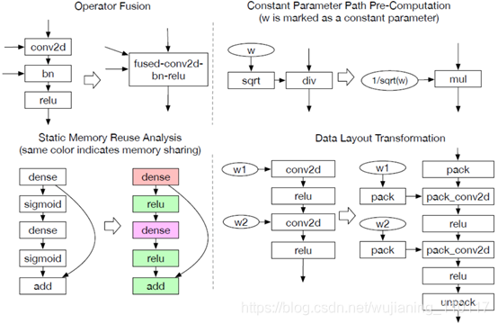
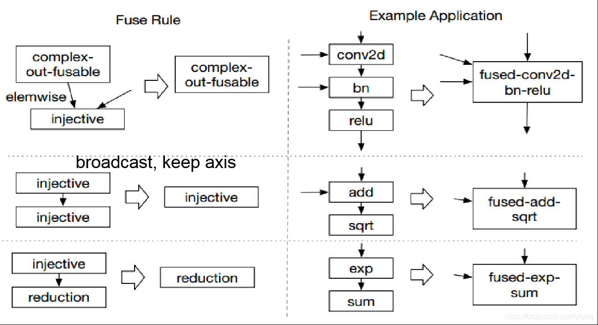
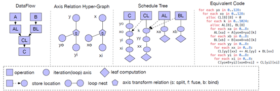

# 2024-06-02 log
## tvm 先关资料
[比较好的参考网站](https://wujianming110117.blog.csdn.net/article/details/117195494?spm=1001.2101.3001.6650.7&utm_medium=distribute.pc_relevant.none-task-blog-2%7Edefault%7EBlogCommendFromBaidu%7ERate-7-117195494-blog-108796250.235%5Ev43%5Epc_blog_bottom_relevance_base7&depth_1-utm_source=distribute.pc_relevant.none-task-blog-2%7Edefault%7EBlogCommendFromBaidu%7ERate-7-117195494-blog-108796250.235%5Ev43%5Epc_blog_bottom_relevance_base7&utm_relevant_index=14)
#### 图级别优化
  
##### 算子融合原则
[参考](https://blog.csdn.net/Artyze/article/details/108796250)
  


#### 算子级别优化
[参考](https://wujianming110117.blog.csdn.net/article/details/117195494?spm=1001.2101.3001.6650.6&utm_medium=distribute.pc_relevant.none-task-blog-2%7Edefault%7EBlogCommendFromBaidu%7ERate-6-117195494-blog-108796250.235%5Ev43%5Econtrol&depth_1-utm_source=distribute.pc_relevant.none-task-blog-2%7Edefault%7EBlogCommendFromBaidu%7ERate-6-117195494-blog-108796250.235%5Ev43%5Econtrol&utm_relevant_index=11)



## leetCode
```cpp
void quickSort(vector<int>& nums){
    if (nums.size() <=1) return;
    int l = 0, r = nums.size()-1;

}

int sub(vector<int>& nums, int l, int r){
    int temp = nums[l];
    while(l<r){
        while(l<r && nums[l] < temp)
            l++;
        swap(nums[l], temp);
        while(l<r && nums[r] >temp)
            r--;
        swap(nums[l], nums[r]);
    }
    return l;
}


//左闭右开
void quick_sort(vector<int>& nums, int l, int r){
    if(l + 1 >= r)
        return;
    int first = l, last = r-1, key = nums[first];
    while(first< last){
        while(first < last && nums[last] >= key){
            --last;
        }
        nums[first] = nums[last];
        while(first < last && nums[first]<=key){
            ++first;
        }
        nums[last] = nums[first];
    }
    nums[first] = key;
    quick_sort(nums, l, first);
    quick_sord(nums, first=1， r)；
}

// 归并排序
void merge_sort(vector<int> &nums, int l, int r, vector<int> &temp){
    if(r+1 =r){
        return;
    }
    //divide

    int m = l + (r-l) / 2;
    merge_sort(nums, l, m, temp);
    merge_sort(nums, m, r, temp);
    
    //conquer
    int p = l, q = m, i=l;
    while(p<m || q<r){
        if(q>=r || (p<m && nums[p] <= nums[q])){
            temp[i++] = nums[p++];
        }else{
            temp[i++] = nums[q++];
        }
    }
    for(int i=l; i<r; ++i ){
        nums[i] =temp[i];
    }
}

void insertion_sort(vector<int> &nums, int n){
    for(int i=0 ; i<n ; ++i){
        for(int j=i, j > 0 && nums[j] <nums[j-1]; --j){
            swap(nums[j], nums[j-1]);
        } 
    }
}

int findKthLargest(vector<int>& nums, int k){
    int l =0; r = nums.size()-1; target = nums.size()-k;
    while(l<r){
        int mid = quickSelection(nums, l ,r);
        if(mid == target){
            return nums[mid];
        }
        if(mid < target){
            l = md + 1;
        }else{
            r = mid -1;
        }
    }
    return nums[l];
}
int quickSelection(vector<int>& nums, int l, int r){
    int i = l + 1， j = r;
    while(true){
        while(i<r && nums[i] <= nums[l]){
            ++i;
        }
        while(l <j && nums[j] >= nums[l]){
            --j;
        }
        if(i>=j){
            break;
        }
        swap(nums[i], nums[j]);

    }
    swap(nums[l], num[j]);
    return j;
}

```